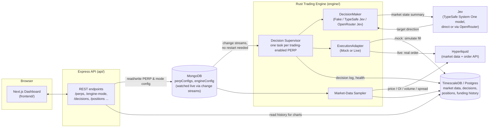

# Jeeva

Jeeva is an AI-assisted trading application for Hyperliquid perpetual futures. It watches the market, periodically asks an AI decision model ("Jev") whether a given market should be long, short, or flat, and moves each position to match — either against a simulated paper-trading wallet or a real Hyperliquid wallet.

A dashboard lets you turn markets on/off, tune how often and how aggressively each one trades, choose which decision engine drives it, and watch the resulting decisions, positions, and P&L in real time.

## What it does

- **Tracks markets.** For every Hyperliquid PERP you enable sampling on, Jeeva continuously records price, open interest, volume, and spread.
- **Makes trading decisions.** For every PERP you enable trading on, Jeeva periodically builds a summary of recent market conditions and asks a **DecisionMaker** for a target direction: `long`, `short`, or `flat`.
- **Executes the decision.** If the target direction differs from the current position, Jeeva closes/opens the position accordingly. Nothing happens if the target direction is unchanged (no re-buying, no pyramiding).
- **Trades safely by default.** New markets and a fresh deployment always start in **mock** mode against a simulated wallet. Real Hyperliquid orders only happen once you explicitly flip a market-wide switch to **live** *and* the engine has real wallet credentials configured.
- **Protects itself.** If a PERP's decision cycle fails five times in a row (bad data, a down decision API, a broken order, etc.), Jeeva force-flattens that PERP's position rather than leaving it in an unmanaged state.

## Architecture



**frontend/** — the operator dashboard (Next.js). Lists markets, shows live price/positions/health, and is where you enable trading/sampling per PERP, pick a PERP's decision maker, and flip the engine between mock and live execution.

**api/** — a small Express service that mediates between the dashboard and the shared state: PERP configuration and engine mode live in MongoDB; market data, decisions, positions, and funding history live in TimescaleDB (used as plain Postgres).

**engine/** — the always-running Rust process that actually trades. It watches MongoDB for configuration changes and, for every PERP with trading enabled, runs an independent loop on that PERP's configured frequency. Nothing here requires a restart to pick up a config change (enabling a market, changing its frequency/leverage/decision maker, flipping mock/live) — every loop iteration reads the latest config fresh.

## The decision cycle

Each tick of a trading-enabled PERP's loop does the following, in order:

1. **Read recent market history** for that PERP (up to the last 1000 samples) from TimescaleDB.
2. **Read the current position** (flat/long/short) from the configured `ExecutionAdapter`.
3. **Summarize state and ask the DecisionMaker** for a target direction (see [What Jev sees](#what-jev-sees) below).
4. **Diff target vs. current position**:
   | Current | Target | Action |
   |---|---|---|
   | flat | long/short | open |
   | long/short | flat | close |
   | long | short (or vice versa) | close, then open the opposite side |
   | long/short | same direction | no-op (no pyramiding) |
5. **Apply the action** through the `ExecutionAdapter` — a simulated fill in mock mode, a real signed Hyperliquid order in live mode.
6. **Log the cycle** (context, decision, action taken, any error) so every tick is auditable from the dashboard, even ticks that fail.

A run of 5 consecutive failures on any step (market data, decision maker, or execution) auto-flattens that PERP's position as a safety net.

## What Jev sees

Jev never sees raw database rows — the engine builds a compact text summary of everything relevant and asks a single structured **Choice** question (`long` / `short` / `flat`). For example, the `state` text sent looks like:

```
BTC: price=64213.50 (change over last 1000 samples: +1.84%, min=62900.10, max=64580.00, avg=63750.22),
open_interest=182340.00 (min=178000.00, max=185200.00, avg=181500.00),
volume=942310.00 (min=810000.00, max=1050000.00, avg=925000.00),
spread=0.0120 (min=0.0080, max=0.0210, avg=0.0130),
mid_price=64214.00;
position=long (opened_at=2026-09-19T18:02:11Z, held_for_minutes=42.0, entry_price=63800.00, notional_usd=1000.00, unrealized_pnl_usd=+6.48);
funding_rate=0.000031 (as_of=2026-09-19T18:00:00Z)
```

That's: the latest price plus min/max/average over the whole sampled window, the same stats for open interest/volume/spread, the current position (or `flat`) with how long it's been held and its unrealized P&L, and the most recent real funding rate. Jev responds with a choice (`long`/`short`/`flat`), a confidence, and a probability for each of the three outcomes — all of which get written to the decision log.

## DecisionMaker: three ways to reach Jev (or not)

Every PERP picks its own decision maker independently of every other PERP, and independently of the mock/live execution switch:

| DecisionMaker | What it does |
|---|---|
| **Fake** | No network calls — cycles through synthetic decisions. The default, safe for a fresh deployment or local development with no external credentials. |
| **TypeSafe Jev** | Calls TypeSafe's `systemOne` API directly, authenticated with `TYPESAFE_API_KEY`. |
| **OpenRouter Jev** | Reaches the same Jev model via OpenRouter instead of TypeSafe directly. **Not implemented yet** — selectable in the dashboard, but every decision cycle will fail until this is built (tracked as a GitHub issue). |

Because decision maker and execution mode are independent axes, you can, for example, run TypeSafe Jev's real decisions against the mock execution wallet — paper-trading with real intelligence, no funds at risk.

## Mock vs. live execution

Execution mode is engine-wide (not per PERP) and stored in MongoDB, so switching it from the dashboard takes effect on the very next decision cycle for every trading-enabled PERP — no restart.

- **Mock** (default): simulates fills against a shared virtual wallet in TimescaleDB. Never touches the real orderbook.
- **Live**: places real signed orders against Hyperliquid using a configured wallet private key. If no key is configured, switching to live fails loudly on every call instead of silently doing nothing.

## Safety mechanisms

- Fresh deployments and fresh PERPs default to mock execution and the Fake decision maker — nothing trades for real until you explicitly opt in.
- Enabling trading on a PERP automatically enables sampling for it too (you can't trade blind); disabling sampling automatically disables trading.
- 5 consecutive decision-cycle failures auto-flattens that PERP's position.
- Every decision cycle — successful or failed — is written to an audit log visible in the dashboard.

## Getting started

```bash
cp .env.example .env   # set AUTH_USERNAME / AUTH_PASSWORD / JWT_SECRET
docker compose up --build
```

This starts MongoDB (as a single-node replica set, required for the config change streams), TimescaleDB, the API on `:4000`, the engine, and the dashboard on `:3000`. With no further configuration, every PERP you enable defaults to mock execution and the Fake decision maker, so you can explore the whole flow with no external credentials.

To use real Jev decisions or real Hyperliquid execution, set the corresponding engine environment variables before enabling them from the dashboard:

| Variable | Needed for |
|---|---|
| `TYPESAFE_API_KEY` (+ optional `TYPESAFE_BASE_URL`) | TypeSafe Jev decision maker |
| `HYPERLIQUID_PRIVATE_KEY` (+ optional `HYPERLIQUID_TESTNET`) | Live execution |

See [`CONTEXT.md`](./CONTEXT.md) for the project's internal glossary and naming conventions.
